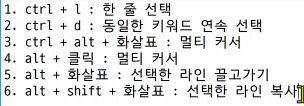
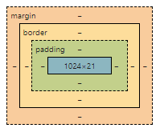

### Emmet 
- https://docs.emmet.io/cheat-sheet/
```html
div>.container>h1{hello}+nav>ul>li*5>a{Link $}
<div>
    <div class="container">
        <h1>hello</h1>
        <nav>
            <ul>
                <li><a href="">Link 1</a></li>
                <li><a href="">Link 2</a></li>
                <li><a href="">Link 3</a></li>
                <li><a href="">Link 4</a></li>
                <li><a href="">Link 5</a></li>
            </ul>
        </nav>
    </div>
</div>
```

#### VS code 단축키 



# 반응형 웹 디자인 Responsive Web Design
- 디바이스 종류나 화면 크기에 상관없이, 어디서든 일관된 레이아웃 및 사용자 경험을 제공하는 디자인 기술

## Bootstrap Grid System
- 웹 페이지의 레이아웃을 조정하는데 사용되는 12개의 컬럼으로 구성된 시스템
- 목적 : 반응형 디자인을 지원해 웹 페이지를 모바일, 태블릿, 데스크탑 등 다양한 기기에서 적절하게 표시할 수 있도록 도움 
- 12개인 이유 : 약수가 많다 - 레이아웃을 다양하게 배치할 수 있다 

## Grid System 기본 요소 
- Container
- Column : 실제 컨텐츠를 포함하는 부분
- Gutter : 컬럼 사이의 여백
- 1개의 row 안에 12개의 column 영역이 구성 
    - 각 요소는 12개 중 몇 개를 차지할 것인지 지정됨 
```html
<div class="container">
    <div class="row">
        <div class="col-4"></div>
        <div class="col-4"></div>
        <div class="col-4"></div>
    </div>
</div>
```

### Gutter 
- x 축은 padding, y 축은 margin 으로 여백 생성 
- 서로 다른 행 끼리는 margin 
- column 끼리는 padding 

### Grid system breakpoints
- 12개의 column과 6개의 breakpoints를 사용
- 웹 페이지를 다양한 화면 크기에서 적절하게 배치하기 위한 분기점
- 화면 너비에 따라 6개의 분기점 제공 (xs, sm, md, lg, xl, xxl)
- 각 breakpoints마다 설정된 최대 너비 값 ***이상으로*** 화면이 커지면 grid system 동작이 변경됨
- xs,    sm,    md,    lg,    xl,    xxl
-    576    768    992    1200   1400
- xs 는 키워드가 없음 

### Media Query 
- 재조정이 필요한 경우 해당 부분을 참고하여 진행할 것 

## Grid system 은 화면 크기에 따라 12개의 칸을 각 요소에 나누어 주는 것 

### Grid cards : ros-cols 클래스 활용 - 행당 표시할 열(카드)수 제어 

## 에어비앤비
- Grid system
- Flexbox 
- Position

### 클론코딩으로 학습하십시오
- 주의사항 : 컨텐츠 적은 쉬운 것 부터 시작해보십시오 
### web.dev


# 기욱쌤 보충
- 정답은 없지만 더 나은 방향은 있음
- 오늘 수업 내용은 부트스트랩에서 내용 잡는 레이아웃에 관한 내용
- 금요일에 진행할 관통 프로젝트 
- mdn 부트스트랩 문서 보면서 진행하자 

- 모두 기본적으로 값을 갖는다 
    - box : margin, border, padding, content
    - 

- normal flow : 아래로 흐름 
    - block : 기본적으로 화면에 나타나는 영역을 다 씀 (밑으로 쌓임)
        - 화면의 구조를 잡기 위해 밑으로
    - inline : 내가 만든 영역 만큼만 쓴다 (normal flow 벗어남)
        - 문장 구성을 위해 왼쪽에서 오른쪽으로 갖는다 


