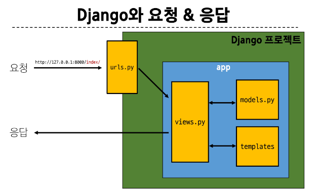

## Web application (web service) 개발
- 인터넷을 통해 사용자에게 제공되는 소프트웨어 프로그램을 구축하는 과정
- 다양한 디바이스(모바일, 태블릿, pc 등) 에서 웹 브라우저를 통해 접근하고 사용할 수 있음

#### 웹의 동작 방식
- 우리가 컴퓨터 혹은 모바일 기기로 웹 페이지를 보게 될 때까지 무슨 일이 일어날까?

### 클라이언트-서버 구조
- requests
- responses
### 클라이언트
- 서비스를 요청하는 주체 
- 웹 사용자의 인터넷이 연결된 장치, 웹 브라우저

### 서버
- 클라이언트의 요청에 응답하는 주체
- 웹 페이지, 앱을 저장하는 컴퓨터

### 일련의 과정
- 웹 브라우저 (클라이언트)에서 google.com 입력
- 브라우저는 구글 컴퓨터(서버)에게 google 홈페이지.html 파일을 달라고 요청
- 요청을 받은 구글 컴퓨터는 데이터베이스에서 google 홈페이지.html 파일을 찾아 응답
- 전달받은 google 홈페이지.html 파일을 사람이 볼 수 있도록 브라우저가 해석해주면서 사용자가 구글의 메인 페이지를 보게 됨

### 웹 개발에서의 Frontend와 Backend
- Frontend
    - 사용자 인터페이스(UI)를 구성하고, 사용자와 애플리케이션과 상호작용할 수 있도록 함 
    - HTML, CSS, JavaScript, 프론트엔드 프레임워크 등
- Backend
    - 서버 측에서 동작하며, 클라이언트의 요청에 대한 처리와 데이터베이스와의 상호작용 등을 담당
    - 서버 언어 (Python, Java 등) 및 백엔드 프레임워크, 데이터베이스, API, 보안 등 

## Framework
### Web Framework
#### 웹 서비스 개발에 필요한 것
- 로그인, 로그아웃, 회원관리, 데이터베이스, 보안 등 많은 기술 필요
- 하나부터 열까지 개발자가 모두 작성하는 것은 현실적으로 어려움
- 모든 걸 직접 만들 필요는 없음
- 잘 만들어진 것들을 가져와 좋은 환경에서 내 것으로 잘 사용하는 것도 능력인 시대

### Web Framework
- 웹 애플리케이션을 빠르게 개발할 수 있도록 도와주는 도구
- 개발에 필요한 기본구조, 규칙, 라이브러리 등을 제공

## Django
- python 기반의 대표적인 웹 프레임워크
- 다양성 : 광범위한 서비스 개발에 적합
- 확장성 : 대량의 데이터에 대해 빠르고 유연하게 확장 기능 제공
- 보안 : 취약점으로부터 보호하는 보안기능 내장
- 커뮤니티 지원 : 활성화된 커뮤니티 존재
- Spotify, Instagram, Dropbox

### 가상환경
- 의존성 관리 : 라이브러리, 패키지를 프로젝트마다 독립적으로 사용 가능
- 팀 프로젝트 협업 : 버전간 충돌을 방지
- Python 애플리케이션과 그에 따른 패키지들을 격리하여 관리할 수 있는 독립적인 실행 환경
- A와 B 프로젝트의 다른 패키지 버전 사용을 위한 독립적인 개발 환경이 필요
- 공존할 수 없는 패키지 - 충돌이 일어나는 경우 
- `python -m venv venv`
- `source venv/Scripts/activate`
- `pip list`

### 패키지 목록이 필요한 이유
- 어떤 패키지, 어떤 버전을 설치했는지 가상환경 상황을 알아야 실행할 수 있음
- 패키지 목록이 공유되어야 됨 
- `pip freeze > requirements.txt`

### 의존성 패키지의 중요성
- 한 소프트웨어 패키지가 다른 패키지의 기능이나 코드를 사용하기 때문에 그 패키지가 존재해야만 제대로 작동하는 관계
- 사용하려는 패키지가 설치되지 않았거나, 호환되는 버전이 아니면 오류가 발생하거나 예상치 못한 동작을 보일 수 있음
- 개발환경에서는 각각의 프로젝트가 사용하는 패키지와 그 버전을 정확히 관리하는 것이 중요 
- ***가상 환경 & 의존성 패키지 관리***

#### Django 프로젝트, 앱 생성 루틴
- 가상환경 생성 : `python -m venv venv`
- 가상환경 활성화 : `source venv/Scripts/activate`
- 가상환경 비활성화 : `deactivate`
- Django 설치 : `pip install django`
- 의존성 패키지 목록 생성(패키지 새로 설치 시마다 진행) : `pip freeze > requirements.txt`
- 의존성 패키지 목록을 통해 패키지 받아오기 (동기화) : `pip install -r requirements.txt`

- 프로젝트 만들기 : `django-admin startproject firstpjt .`
    - 뒤에 한칸 띄고 `.`을 찍어줘야 해당 경로에 바로 manage.py 파일이 생성됨, 
    - 그렇지 않을 경우 디렉토리가 한 depth 더 들어가기 때문에 서버 실행을 위해서는 경로를 바꿔야 함 - 번거로울 수 있음 
- django 서버 실행 : `python manage.py runserver` (manage.py와 동일한 경로에서 진행)
- 서버 종료 : `ctrl + c` (manage.py와 동일한 경로에서 진행)

- ***반드시 앱을 생성한 후에 등록해야 함***
- 앱 생성 : `python manage.py startapp articles`
- 앱 등록 : 프로젝트 폴더 내의 settings.py - INSTALLED APPS 리스트 안에 `'application이름',`으로 등록해야함

```python
from django.contrib import admin
from django.urls import path
from todos import views

urlpatterns = [
    path('admin/', admin.site.urls),
    path('todos/', views.index)
]

from django.shortcuts import render

# Create your views here.
def index(request):
    return render(request, 'todos/index.html')

```

### Git 과 함께 쓴다면 
1. 가상 환경 생성
2. 가상 환경 활성화
3. Django 설치
4. 의존성 파일 생성 (패키지 설치시마다 진행)
5. `.gitignore`파일 생성 (첫 add 전) - 가상환경은 원격저장소에 올리지 않음
6. git 저장소 생성
7. Django 프로젝트 생성 

### LTS (Long-Term Support)
- 장기간 지원되는 안정적인 버전을 의미할 때 사용
- 안정적이고 장기간 지원되는 버전이 필요

### Django 는 Full Stack framework 인가요?
- 맞지만 frontend 부분은 제한적임 
- 전문적인 frontend framework 들에 비해서 미흡 
- Backend에 속한다고 볼 수 있음 

## Django Design Pattern 디자인 패턴
- 소프트웨어 설계에서 발생하는 문제를 해결하기 위한 일반적인 해결책
- 공통적인 문제를 해결하는 데 쓰이는 형식화된 관행
- 애플리케이션의 구조는 이렇게 구성하자 라는 관행 

### MVC 디자인 패턴 Model, View, Controller
- 애플리케이션을 구조화하는 대표적인 패턴
- 데이터 & 사용자 인터페이스 & 비즈니스 로직

### MTV 디자인 패턴 Model, Template, View
- Django에서 애플리케이션을 구조화하는 패턴 
- 단순히 명칭을 다르게 정의한 것

### Project & App
- 프로젝트 안에 기능별로 App들이 존재함 

#### Django Project
- 애플리케이션의 집합
- DB 설정, URL 연결, 전체 앱 설정 등을 처리
#### Django Application
- 독립적으로 작동하는 기능 단위 모듈
- 각자 특정한 기능을 담당하며 다른 앱들과 함께 하나의 프로젝트를 구성

### 앱 생성
- ***반드시 앱을 생성한 후에 등록해야 함***
- `python manage.py startapp articles`
- 앱의 이름은 복수형으로 지정하는 것을 권장

### 앱 등록 
- 반드시 앱을 생성한 후에 등록해야 함 (등록 후 생성은 불가능)
- 프로젝트 폴더 내의 settings.py - INSTALLED APPS 리스트 안에 
- `'application이름',`으로 등록해야함

### 프로젝트 구조
- settings.py : 프로젝트의 모든 설정을 관리
- urls.py : 요청 들어오는 URL에 따라 이에 해당하는 적절한 views를 연결

- __init__.py : 프로젝트를 패키지로 인식하도록 설정
- manage.py : Django 프로젝트와 다양한 방법으로 상호작용하는 커맨드라인 유틸리티
- asgi.py : 비동기식 웹 서버와의 연결 관련 설정
- wsgi.py : 웹 서버와의 연결 관련 설정

### 앱 구조
- admin.py : 관리자용 페이지 설정
- models.py : DB와 관련된 Model을 정의
- views.py : HTTP 요청을 처리하고 해당 요청에 대한 응답을 반환 
    - url, model, template와 연계
- apps.py : 앱의 정보가 작성된 곳
- tests.py : 프로젝트 테스트 코드를 작성하는 곳

## 요청과 응답
- 요청 -> urls.py -> views.py
- views.py <-> models.py, templates : 응답할 결과 받아오기
- views.py -> 응답 

### url, view, template
1. urls.py -> urlpattern 추가
    - 앱 이용할 경우 from app_name imports views
    - 앱 내의 views 에서 렌더링 함수 가져옴 
    - `path('index/', views.index),`
2. app 내의 views.py 
```python
# 메인 페이지를 만드는 index라는 이름의 함수를 작성
def index(request):
    return render(request, 'articles/index.html')
# render(요청객체, 템플릿 이후 경로)
# templates 이후의 경로가 들어감
```
- 해당 양식대로 경로 작성
3. templates 경로에서 렌더링 html 페이지 생성 및 수정 

### render 함수의 변수
- request
- template_name
- context : 템플릿에서 사용할 데이터 (딕셔너리 타입으로 작성)

# 기욱쌤 보충

- 이 부분이 오늘 제일 중요함 
- 프레임워크를 어떻게 사용하는지 익숙해지는게 더 중요함 
- 프레임워크를 배우는 것 : 다른 프레임워크 배울 때도 공부법이 다르지 않기 때문에 다른 프레임워크 배울 때도 비슷한 공부법, 사용법에 익숙해지기 쉬움
- 오늘 라이브 다시 듣는 것을 매우 권장 

## 진짜 보충 
- 서버 : 운영체제가 조금 다른 컴퓨터 - 리눅스, 우분투 등 
- 우리는 내 자신이 클라이언트, 서버가 되는 연습을 하는 것임 
- 서버를 실행했을 때 (요청을 보냈을 때), git bash 창을 항상 확인할 것
    - 요청은 제대로 들어갔는지, 어떤 에러 메시지가 나오는 지 

#### Framework
- 수많은 framework 들이 있지만 성격이 조금은 다름
- 독선적인지, 관용적인지
- django는 독선적인 성격 : 공식 문서를 정독하는 것이 중요하니 많이 참고할 것
    - 웬만한 기능을 구현하는 방법은 공식 문서에 다 있다. 
- spring은 관용적인 성격 
    - 기능 구현을 할 때, 많은 방향과, 방법이 있고 개발자가 직접 작성해야 할 코드가 많음

#### 가상환경 
- 수업이 끝날 때까지 가상환경을 사용할 것임 : 왜? 독립적인 개발 환경 구성
- 회사에서 업무를 할 때도 이미 만들어진 프로젝트를 받아와서 독립적인 환경을 구성하는 것 자체가 중요함 
- global 버전들을 가지는 게 위험할 수 있음 (버전이 안맞으면 실행 자체가 안될 수 있음)

#### Django 프로젝트, 앱 생성 루틴
- 가상환경 생성 : `python -m venv venv`
- 가상환경 활성화 : `source venv/Scripts/activate`
- 가상환경 비활성화 : `deactivate`
- Django 설치 : `pip install django`
- 의존성 패키지 목록 생성(패키지 새로 설치 시마다 진행) : `pip freeze > requirements.txt`
- 의존성 패키지 목록을 통해 패키지 받아오기 (동기화) : `pip install -r requirements.txt`

- 프로젝트 만들기 : `django-admin startproject firstpjt .`
    - 뒤에 한칸 띄고 `.`을 찍어줘야 해당 경로에 바로 manage.py 파일이 생성됨, 
    - 그렇지 않을 경우 디렉토리가 한 depth 더 들어가기 때문에 서버 실행을 위해서는 경로를 바꿔야 함 - 번거로울 수 있음 
- django 서버 실행 : `python manage.py runserver` (manage.py와 동일한 경로에서 진행)
- 서버 종료 : `ctrl + c` (manage.py와 동일한 경로에서 진행)

- ***반드시 앱을 생성한 후에 등록해야 함***
- 앱 생성 : `python manage.py startapp articles`
- 앱 등록 : 프로젝트 폴더 내의 settings.py - INSTALLED APPS 리스트 안에 `'application이름',`으로 등록해야함

### .gitignore
- git을 통해 관리할 때 .gitignore 파일 생성 필수 
- https://gitignore.io/ 를 통해 python, django 를 넣어 gitignore 텍스트를 생성
- .gitignore 파일을 만들어 그 안에 텍스트 삽입
- 가상환경 venv는 commit 되지 않음 +@의 기능

#### MVC 디자인 패턴
- 안정성이 있는 규격화된 디자인 
- 개발자들이 1개의 프로젝트를 관리, 유지, 보수 해야할 때 : 쉽게 유지보수가 가능함 
- 패러다임처럼 만들어진 패턴 

#### MTV
- view : 사실 이 녀석이 화면에 보여질 요소들을 결정하는 주체다 -> view
- template : 이 녀석은 그냥 만들어진 template일 뿐임 

#### 우리가 수정할 일 있는 것 
- project
    - settings.py
        - application 생성 후 등록
    - urls.py : url 요청이 들어왔을 때 가장 첫번 째로 맞이하는 곳 (end-point)
        - 각 url 요청마다 어떤 처리를 할 것인지 -> application의 views.py로 넘기는 역할
        - 처리할 url을 명시할 때 반드시 마지막에 `/`을 붙여서 넣어야 함 
        - views에서 해당 처리에 맞는 함수를 import함 
- application
    - admin.py : 관리자용 페이지 설정 
    - models.py : DB와 관련된 Model을 정의 (MTV 패턴의 M)
    - views.py : HTTP 요청을 처리하고 해당 요청에 대한 응답을 반환 (url, model, template과 연계)
        - views.py 내의 모든 함수는 첫 번째 인자로 요청 객체를 받음 (`request`로 명칭 통일)
        - MTV 패턴의 V
    - templates(폴더) : 해당 폴더 내에 html 파일을 등록함 
        - MTV 패턴의 T
        - view.py에서 render함수의 2번째 인자인 경로는 templates 폴더 이후의 경로를 나타냄 
        - 예를 들어, 'index.html' 을 적용할 경우 해당 html 문서는 templates 폴더 안에 있어야 함 
        - 'hello/hello.html' 의 경우 templates 폴더 안에 hello 폴더 안에 hello.html이 있어야 함 
        
        
- 최초 서버 구동 시 로켓 페이지 : localhost:8000/ 갔을 때 로켓 페이지 설정이 있음 
    - 다른 주소가 urls.py에 추가되면 해당 부분이 적용되지 않아 127.0.0.1:8000/ 에서는 404에러가 나게 됨
