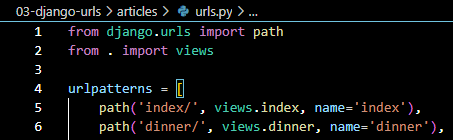
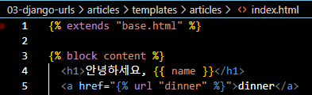

## Django URLs
- 일을 배분하는 역할을 한다 
- 운항 관리자, Dispatcher 
- 어떤 views 함수에게 일을 넘겨줄 것인가

## App과 Url
### App URL mapping
- 각 앱에 URL을 정의하는 것 
- 프로젝트와 각 앱이 URL을 나누어 관리를 편하게 하기 위함 

### 2번째 앱 pages 생성 후 발생할 수 있는 문제
- view 함수 이름이 같거나 같은 패턴의 URL 주소를 사용하게 되는 경우 
```python
from articles import views as article_views
from pages import views as pages_views

```
- URL을 각자 app에서 관리하자
- 프로젝트의 urls.py 에서
```python
from django.urls import path, include

urlpatterns = [

    path('articles/', include('articles.urls')),
    path('pages/', include('pages.urls')),
]
```
- 앱의 urls.py 에서 
```python
from django.urls import path
from . import views

urlpatterns = [
path('index/', views.index)

]
```

### include()
- 프로젝트 내부 앱들의 URL을 참조할 수 있도록 매핑하는 함수
- url의 일치하는 부분까지 잘라내고, 남은 문자열 부분은 후속 처리를 위해 include된 url로 전달 

## url 이름 지정
### url 구조 변경에 따른 문제점 
- url에 이름을 지어주면 이름만 기억하면 되지 않을까?

### Naming URL patterns 적용 
- urls.py에서 `name='urlname'`을 추가 

- html에서 url 태그를 활용

```html
<a href="">dinner</a>
```

### 'url' tag 
- ``
- 주어진 url 패턴의 이름과 일치하는 절대 경로 주소를 반환 

## app_name 
- 서로 다른 앱의 url 이름이 같을 수 있음 
- 이름에 key를 추가 (app name)
- app/urls.py
```python
app_name = 'pages'

```
## URL tag 변경
- `

# Model 
#### Model을 통한 DB(데이터베이스) 관리 
- 우리가 지금 활용하는 정보들은 휘발성 데이터

## Django Model 
- DB의 테이블을 정의하고 데이터를 조작할 수 있는 기능들을 제공
- 테이블 구조를 설계하는 청사진 (blueprint)

### Table
- DB는 여러 table들의 집합

### 클래스 생성 및 models 클래스 상속
```python
from django.db import models

# Create your models here.
class Article(models.Model):
    title = models.CharField(max_length=10)
    content = models.TextField()
```
- 필드의 이름 = 데이터타입
- 결과 : 
    - id필드, title 필드, content 필드 3개가 존재 
    - CharField, TextField : 데이터타입 

## Model 클래스
- django.db.models 모듈의 Model이라는 부모 클래스를 상속받음 
- Model은 model에 관련된 모든 코드가 이미 작성 되어있는 클래스
- 개발자는 가장 중요한 테이블 구조를 어떻게 설계할지에 대한 코드만 작성하도록 하기 위한 것
- 상속을 활용한 프레임워크의 기능 제공 
- 클래스 변수명 = 테이블의 각 필드 이름
- model Field 클래스 = 테이블 필드의 데이터 타입 
- model Field 클래스의 키워드 인자 (필드 옵션) = 테이블 필드의 제약조건 관련 설정 

## 제약 조건
- 데이터가 올바르게 저장되고 관리되도록 하기 위한 규칙 
- ex. 숫자만 저장되도록, 문자가 100자까지만 저장되도록 

## Migrations
- model 클래스의 변경사항(필드 생성, 수정 삭제 등)을 DB에 최종 반영하는 방법
1. model class (설계도 초안)
    -   > makemigrations
2. migration 파일 (최종 설계도)
    -   > migrate
3. db.sqlite3 (DB)

### Migrations 핵심 명령어 2가지 
- `python manage.py makemigrations`
- `python manage.py migrate`

> ***Migration 파일은 절대로 수정하지 말 것***

## 이미 생성된 테이블에 필드 추가
- 이미 기존 테이블이 존재하기 때문에 필드를 추가할 때, 필드의 기본 값 설정 필요
- 현재 대화를 유지하면서 직접 기본 값을 입력 
    - `python manage.py makemigrations`
    - 빈 필드를 추가할 수 없다 : This is because the database needs something to populate existing rows.
    - 무슨 값을 기본으로 할 지 써라 > Provide a one-off default now which will be set on all existing rows.
    - 1 enter -> Accept the default 'timezone.now' by pressing 'Enter' or provide another value.
    - 아무것도 입력하지 않고 enter를 누르면 Django가 제안하는 기본 값으로 설정됨
- 현재 대화에서 나간 후 models.py에 기본 값 관련 설정 

### 추가 모델 필드 작성
- Django는 설계도를 쌓아가면서 추후 문제가 생겼을 시 복구하거나 되돌릴 수 있도록 함
- git commit 과 유사 
> ***model class에 변경사항이 생겼다면 반드시 새로운 설계도를 생성하고 이를 DB에 반영해야 한다.***

## Model Field
- DB 테이블의 필드(열)을 정의하며,
- 해당 필드에 저장되는 데이터 타입과 제약조건을 정의

### CharField()
- 길이의 제한이 있는 문자열을 넣을 때 사용
- 필드의 최대 길이를 결정하는 max_length는 필수 인자임

### TextField()
- 글자의 수가 많을 때 사용

### DateTimeField()
- 날짜와 시간을 넣을 때 사용
- 선택인자
    - auto_now : 저장될 때마다 자동으로 현재 날짜시간 저장
    - auto_now_add : 처음 생성될 때만 자동으로 현재 날짜시간 저장

## Admin site
### Automatic admin interface
- Django는 추가 설치 및 설정 없이 자동으로 관리자 인터페이스를 제공
- 데이터 확인 및 테스트 등을 진행하는데 매우 유용

1. admin 계정 생성
- email은 선택사항이기 때문에 입력하지 않고 진행 가능
- 비밀번호 입력시 보안상 터미널에 출력되지 않으니 무시하고 입력 이어가기
- `python manage.py createsuperuser`

2. DB에 생성된 admin 계정 확인
3. admin에 model 클래스 등록
- admin.py에 작성한 모델 클래스를 등록해야만 admin site에서 확인 가능 
- app/admin.py
```python
from django.contrib import admin
from .models import Article

admin.site.register(Article)

```
4. admin site 로그인 후 등록된 모델 클래스 확인
5. 데이터 생성, 수정, 삭제 테스트
6. sqlite 테이블 확인

### 데이터베이스 초기화
- migration 파일 삭제
- db.sqlite3 파일 삭제
> *** 아래 파일과 폴더를 지우지 않도록 주의 ***
- __init__.py
- migrations 폴더

#### Migrations 기타 명령어 
- `python manage.py showmigrations`
    - migrations 파일들이 migrate 되었는지 여부 확인
    - X : 완료
- `python manage.py sqlmigrate articles 0001`
    - 해당 migrations 파일이 SQL 언어로 어떻게 번역되어 DB에 전달되는지 확인

### CRUD 
- 소프트웨어가 가지는 기본적인 데이터 처리 기능
- Create
- Read
- Update
- Delete

